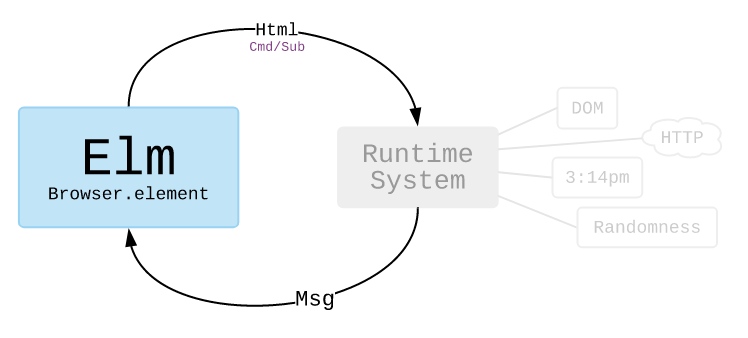
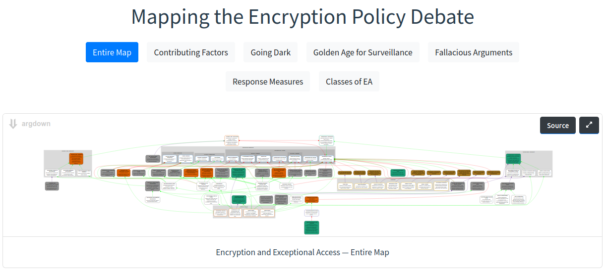
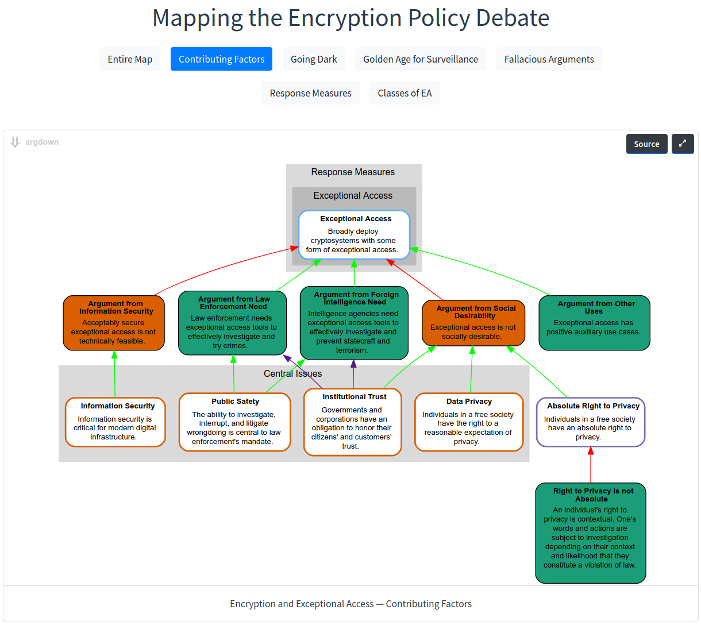

# Software Design of an Elm Application

Kevin Kredit  
ACS 622  
Software Design Methodologies

<!-- a short overview and description of what you did and how it went (2ish pages + more if it includes diagrams). -->

## Overview

This project is a single-page web application to view Argdown [[1]](https://argdown.org/) argument maps relating to
encryption policy and exceptional access. These argument maps are a product of research for my Master's thesis on the
subject of encryption policy. See the app's "About" [[2]](https://kkredit.github.io/arg-viewer/#about) page for more.

The app is deployed to GitHub Pages here [[3]](https://kkredit.github.io/arg-viewer/), though an issue
[[4]](https://github.com/christianvoigt/argdown/issues/202) with the webpack configuration is preventing the map SVGs
from rendering correctly. The source is available on GitHub here [[5]](https://github.com/kkredit/arg-viewer). To run it
locally, install Nodejs, Yarn, and Elm, then execute `yarn install && yarn start`.

The app is written in Elm [[6]](https://elm-lang.org), a Haskell-inspired language that transpiles to JavaScript and
defines its own architecture. This report will describe how the Elm architecture impacts frontend web design, Elm's
JavaScript interoperability, and design choices made for this application.

## The Elm Architecture

The Elm architecture uses immutable values, one-way data-flow, and event-driven processing. It maps well to the time
model developed by Rich Hickey, of Clojure [[7]](https://www.infoq.com/presentations/Are-We-There-Yet-Rich-Hickey/).
Hickey's model differentiates between values, state, identity, process events, and observers. In the Elm language, all
data are immutable values. The application (as the top-level identity) consists of a sequence of states. Change is
managed by the runtime. The runtime generates messages (process events) based on events such as DOM actions or HTTP
requests. The messages are passed to the application along with the current state. The application uses this information
to produce a next state, which is returned to the runtime and mutably integrated. The visible content on the web page is
generated by view functions (observers) purely from the current state. The Elm architecture documentation illustrates
this as shown below [[8]](https://guide.elm-lang.org/effects/).

Using the Elm language has several advantages over basic JavaScript and even the safer TypeScript. Its type system has
no `null` value or exceptions. All situations, including empty values and error conditions are represented using
ordinary data types. Additionally, all functions are complete, meaning that they _must_ return a value of the type that
their type signature indicates. All case statements are complete, meaning that every possible branch, including error
conditions, must be handled. As a result, if an Elm application successfully compiles, it _will_ run without crashing.

The architecture provides advantages as well. Although external events can still cause race conditions, Elm's time model
and data-flow direction eliminate internal race conditions and simplify asynchronous JavaScript operations. The Elm
architecture was a direct inspiration to Redux, which uses the same unidirectional data-flow pattern and has a
reputation for enabling robust JavaScript applications.

Elm's completeness has disadvantages as well. For one thing, if you want to build a rapid prototype, you may not care to
handle every possible error condition, but Elm won't compile until you do. Elm also makes JavaScript interoperability
somewhat difficult. In order to keep Elm functionally pure, JavaScript not callable directly. Elm provides "ports,"
which are essentially JSON APIs to local endpoints on the other side of the Elm/JavaScript wall. Interop is thus
possible, but the developer is forced to use it sparingly and carefully consider which side manages which portions of
application state.

## Design Choices for the Argdown Viewer

The goal building the Argdown viewer application is to internalize the "how" and "why" of the Elm architecture by using
it in a non-trivial app. I decided to implement it as a single-page application in order to understand Elm routing and
multi-level state management, and decided to dynamically generate the argument maps instead of render static images in
order to explore ports and JavaScript interoperability. Deploying to GitHub Pages resulted in some interesting decisions
as well. I discuss each of these next.

### Elm SPA Architecture

The application is split into three main Elm files, `Main`, `Argmaps`, and `About`. `Main` defines the top-level state,
renders the header, and performs URL parsing in order to determine what content to load. `Argmaps` renders the arguments
via ports to the JavaScript side's Argdown manager and includes buttons to update the active map. `About` renders
Markdown source content into HTML. SPAs require layering each level's state and message handling. With Elm's rigid type
system, this more of a challenge than usual, but after experimenting a pattern emerged. The result is robust.

### The Argdown Engine JavaScript Interop

The Argdown maps themselves are rendered using a JavaScript engine provided by the Argdown project. Deciding where to
implement operations and state related to managing the engine was a challenge. Eventually, most of the map configuration
settings came to reside in Elm. When a map is rendered, Elm passes the desired configuration through a port to the
JavaScript side, which runs the engine and updates the map. Instead of returning HTML from the engine back into Elm,
which would require complex types, Elm defines an empty DOM node to hold the map and the JavaScript mounts it directly.

### Deploying to GitHub Pages

Deploying the application to GitHub pages required routing workarounds. GitHub pages routes only a single page to the
hosted application. For example, if the application lives at `/arg-viewer/`, GitHub would say that the page
`/arg-viewer/about` does not exist, even if the SPA contains rules to route that URL to a page. I therefore had to
switch to hash-based routing. The "About" page for example exists at `/arg-viewer/#about`. Elm also expects the
application to be rooted at the base path, i.e., at `/`. Because GitHub pages roots the page at `/project-name/`, I had
to use Elm initialization flags to tell the application the path prefix at which it lives, so that it parses the URL and
generates links relative to that base.

## Summary

Building this application succeeded in teaching me about the benefits of the Elm architecture and how to manage state
safely in event-driven environments. It implements of Hickey's time model exceptionally well for web applications. As a
benefit, I also have a better understanding of Redux. I have enjoyed the unique opportunity to build a new TypeScript
and Redux application at work while studying these concepts. Learning about this time model and domain-driven design as
well as working on this project have directly improved the quality of that product.

This Argdown viewer serves as a way for me to feature some of my thesis research. I intend to fix the webpack
configuration so that the maps render correctly online and use the website to host my thesis once it is published. In
an appendix below, I include two screenshots of the app running locally as proof that it works.

## References

[1] https://argdown.org/  
[2] https://kkredit.github.io/arg-viewer/#about  
[3] https://kkredit.github.io/arg-viewer/  
[4] https://github.com/christianvoigt/argdown/issues/202  
[5] https://github.com/kkredit/arg-viewer  
[6] https://elm-lang.org/  
[7] https://www.infoq.com/presentations/Are-We-There-Yet-Rich-Hickey/  
[8] https://guide.elm-lang.org/effects/

## Appendix: Screenshots

